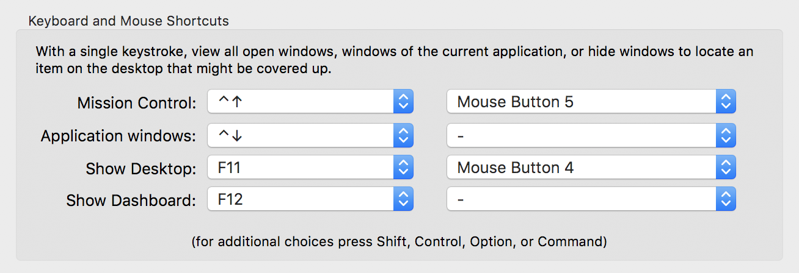

# dotfiles

## Install Xcode
- Open Terminal
- Run `git`
- Click **Install Xcode**

## Install Updates
```shell
sudo softwareupdate -ia --verbose
```

## Clone Repo
```shell
git clone https://github.com/jonmilner/dotfiles.git ~/dotfiles
```

## Install

### Fix Permissions
```shell
sudo chown -R "$USER":admin /usr/local
```

### ZSH
```shell
sh dotfiles/install/zsh.sh
```

### NVM
```shell
curl -o- https://raw.githubusercontent.com/creationix/nvm/v0.33.1/install.sh | bash
```

### Node
```shell
nvm install stable
nvm use node
nvm alias default node
sh dotfiles/install/npm.sh
```

### Homebrew
```shell
sh dotfiles/install/brew.sh
```

### Symlinks
```shell
sh dotfiles/setup.sh
```

### zsh-syntax-highlighting
```shell
git clone https://github.com/zsh-users/zsh-syntax-highlighting.git ${ZSH_CUSTOM:-~/.oh-my-zsh/custom}/plugins/zsh-syntax-highlighting
```

### OSX defaults
```shell
sh dotfiles/macos/set-defaults.sh
```

### Mackup
Once DropBox is set up, use Mackup to restore Application settings.

```shell
mackup restore
```

## Applications Setup
```shell
sh dotfiles/install/openApps.sh
```

## Additional Setup

### Mission Control Mouse Setup

